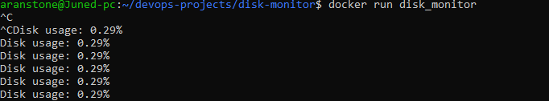

# disk monitor

Description:
This project checks disk usage and prints it in realtime.
It is containerized with Docker.

Tools:
- Python
- Docker
- Linux

How to run:
```bash
docker build -t disk_monitor .
docker run disk_monitor
```

Output:
Prints the disk usage in real time.

Screenshot:
 

