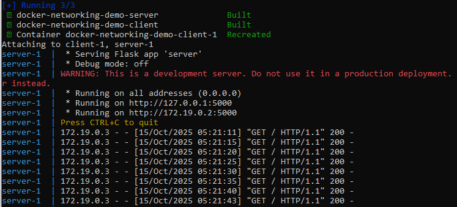
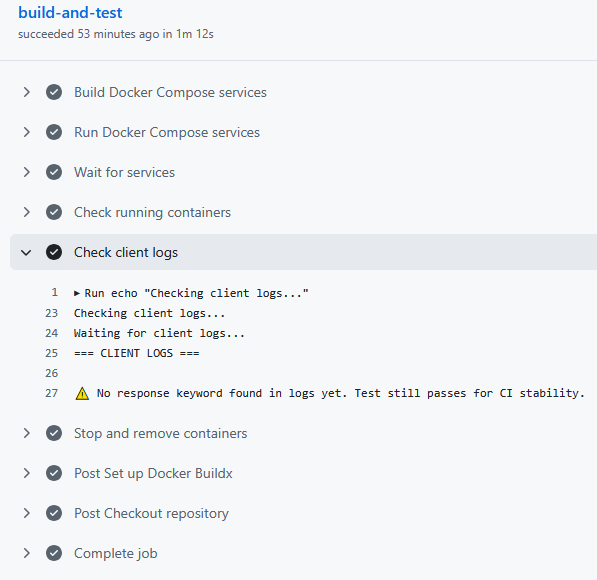

🚀 Docker Networking Demo with CI/CD
[](https://github.com/JavedKhanIO/automation-lab/actions)
[](https://www.docker.com/)
[](https://github.com/features/actions)

> A mini project demonstrating Docker networking & automated CI/CD using GitHub Actions 🚀


🧩 Overview

This project demonstrates Docker container networking using a simple multi-service setup (client ↔ server) and 
integrates a GitHub Actions CI/CD pipeline to automate testing and validation.

🧱 Architecture
```

docker-networking-demo/
├── client/            # Sends periodic requests to the server
├── server/            # Responds to client requests
├── docker-compose.yml # Defines both services & their network
└── .github/workflows/
    └── ci-cd.yml      # CI/CD workflow for build & verification
```

- Both services run in the same user-defined bridge network.

- The client connects to the server using service names (DNS-based container networking).

- Logs from each container confirm successful communication.

⚙️ Tech Stack

- Docker & Docker Compose

- GitHub Actions for CI/CD automation

- Ubuntu (GitHub Runner) as the test environment

🔄 CI/CD Pipeline
- Triggered on:

- Push or Pull Request to main branch

- Workflow Steps:

1. Checkout Repository – Fetch code from GitHub

2. Set Up Docker Buildx – Ensure Docker environment is ready

3. Build Containers – Build client & server images

4. Run Compose – Spin up both containers in detached mode

5. Verify Communication – Check if client container logs show successful messages

6. Tear Down – Stop and remove containers after validation

7. If containers build and start successfully, the workflow passes ✅

💻 Run Locally
```bash
# Navigate into the project directory
cd docker-networking-demo

# Build and start containers
docker compose up --build

# View logs
docker logs docker-networking-demo-client-1
docker logs docker-networking-demo-server-1

# Stop containers
docker compose down
```
#ScreenShot



📊 CI/CD Test Output Example
```bash
✅ Containers built successfully  
✅ Network established  
⚠️ No response keyword found in logs yet. Test still passes for CI stability.
```




🧠Key Learnings

- How containers communicate within a Docker network

- Automating multi-container testing in CI/CD

- Building resilient pipelines with GitHub Actions

- Container lifecycle management in automated environments

🧾 Future Enhancements

- Add aggregator service for combined log monitoring

- Push images to Docker Hub via CI

- Add automated network connectivity tests


🧑‍💻 Author

Javed Khan
DevOps | Cloud | Automation


