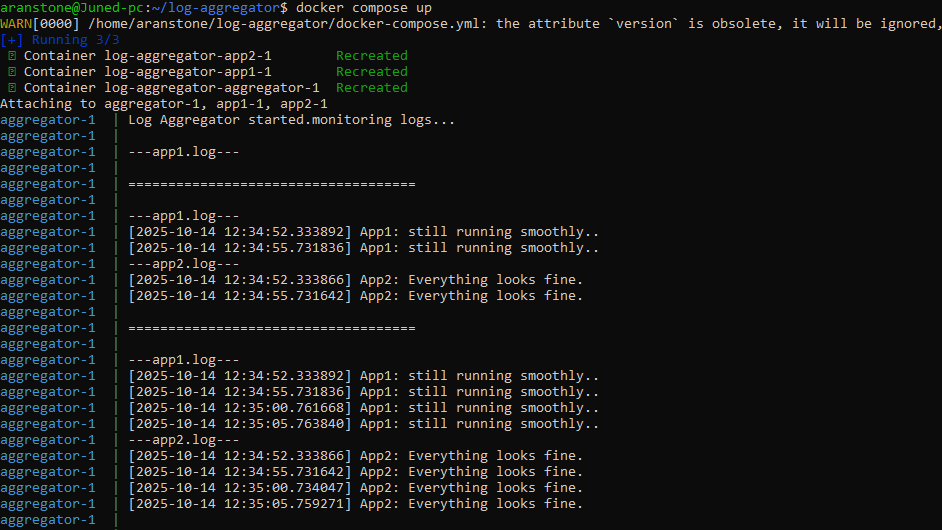
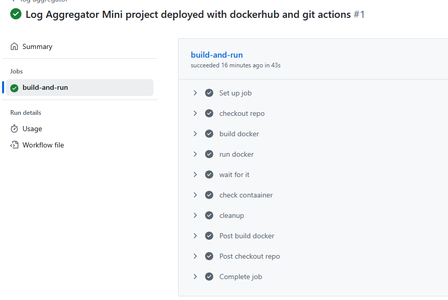

# Log Aggregator
📘 Description

This project demonstrates a multi-container log aggregation system built with Python and Docker Compose,  
automated through GitHub Actions CI/CD.

It simulates a real-world scenario where multiple microservices (App1, App2) generate logs that are collected 
and displayed in real time by a central Aggregator service.

🧰 Tools & Technologies

- Python 3.12 — for writing lightweight micro-apps

- Docker & Docker Compose — for containerized multi-service orchestration

- GitHub Actions — for CI/CD automation (build, test, and cleanup)

- Linux (Ubuntu) — for environment setup and testing

```
⚙️ Architecture Overview
log-aggregator/
│
├── app1/
│   ├── app1.py
│   └── Dockerfile
│
├── app2/
│   ├── app2.py
│   └── Dockerfile
│
├── aggregator/
│   ├── aggregator.py
│   └── Dockerfile
│
├── docker-compose.yml
└── .github/workflows/aggregator-cd.yml
```

App1 & App2 continuously generate logs every 5 seconds.

Aggregator reads and displays the latest logs from both apps every 10 seconds.

All services share a common volume (logs.txt) for real-time log exchange.

🚀 How to Run Locally
# Build and start all containers
docker compose up --build


The aggregator will display logs from both apps every few seconds:
```
---app1.log---
[2025-10-20 14:12:38] App1: still running smoothly..
---app2.log---
[2025-10-20 14:12:38] App2: Everything looks fine.
====================================
```
#Screenshot for local run output




🤖CI/CD Automation (GitHub Actions)

- This project is fully automated with a CI/CD pipeline using GitHub Actions.

- Workflow file: .github/workflows/aggregator-cd.yml

#Pipeline stages:

- Trigger: Runs automatically on every push or pull request to the main branch.

- Checkout: Fetches the repository code.

- Build: Uses Docker Buildx to build all images defined in docker-compose.yml.

- Run: Starts containers in detached mode and waits for services to stabilize.

- Validate: Checks container status (docker ps -a).

- Cleanup: Brings down all containers to keep the runner clean.

🧩 Output Preview

✅ App1 & App2: Write logs every 5 seconds
✅ Aggregator: Reads and prints combined logs every 10 seconds
✅ GitHub Actions: Automates build → run → validate → teardown

📸 Screenshot



💡 Future Enhancements

Add a Redis-based centralized log store for scalable message handling.

Implement Flask REST API for live log streaming.

Extend CI/CD to include automated tests and push to Docker Hub.

Author
Javed Khan

