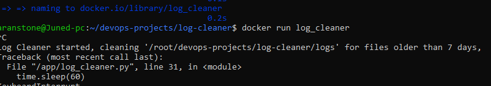

# Log Cleaner

Description:
This project automatically deletes old log or temp files in a Linux folder.
It logs each deletion with date and timestamp and is containerized with Docker.

Tools:
- Python
- Docker
- Linux

How to run:

**Local folder cleanup:**
```bash
# Default folder inside home directory
python3 log_cleaner.py

# Clean a specific folder
python3 log_cleaner.py /path/to/target/folder
```
# Build container
docker build -t log_cleaner .

# Run container cleaning default folder
docker run log_cleaner

# Run container cleaning a host folder
docker run -v /path/to/host/folder:/app/logs log_cleaner

#Output:

Prints deleted file names with timestamp every 60 seconds.

Deletes files older than 7 days in the target folder

Screenshot:

