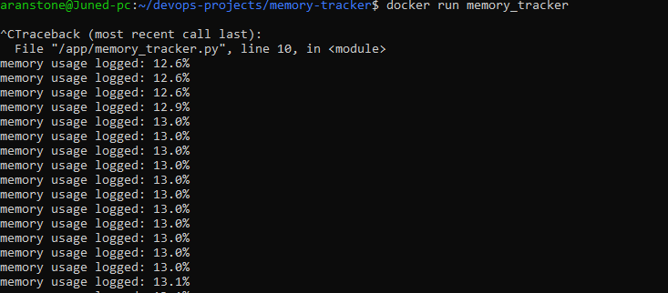

# Memory Tracker

Description:
This project checks cpu memory usage and prints it continuosly in realtime using Python.
It is containerized with Docker.

Tools:
- Python
- Docker
- Linux

How to run:
```bash
docker build -t memory_tracker .
docker run memory_tracker
```

Output:
Prints the cpu memory usage in real time.

Screenshot:


