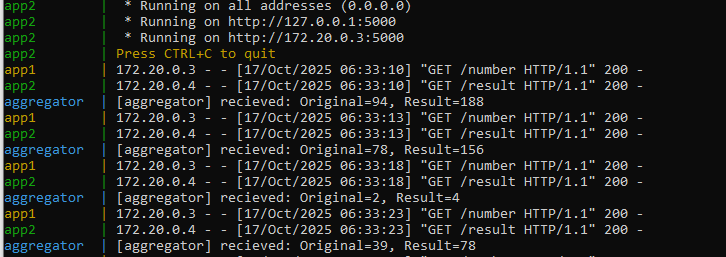
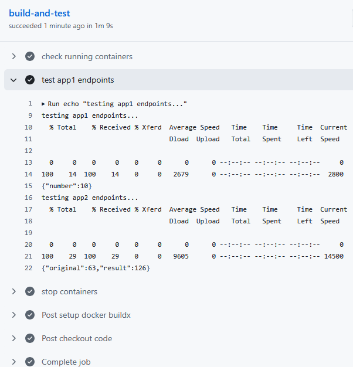

🚀Multi-App Demo with Aggregator & CI/CD


# CI/CD Status

A mini project demonstrating multi-container communication with an aggregator service and 
automated CI/CD pipeline using GitHub Actions.

🧩 Overview

This project demonstrates inter-container communication using three services:

app1 → generates a random number every 5 seconds

app2 → multiplies the number by 2

aggregator → collects the original number and result, prints to console, and logs to log.txt

The project also integrates GitHub Actions CI/CD to automate container builds, 
verify endpoints, and validate communication between services.

🧱 Architecture
```
multi-app-demo/
├── app1/                 # Generates random numbers
├── app2/                 # Multiplies numbers from app1
├── aggregator/           # Collects and logs original & result
├── docker-compose.yml    # Defines all services & network
└── .github/workflows/    # CI/CD workflow
    └── multi-app-demo-ci-cd.yml

```
- All services run in the same Docker bridge network.

- app1 and app2 expose ports for testing; aggregator polls app2 every 5 seconds.

- log.txt inside aggregator stores all received numbers and results.

⚙️ Tech Stack

- Python 3.12 (Flask, Requests)

- Docker & Docker Compose

- GitHub Actions (CI/CD automation)

- Ubuntu (GitHub Runner) as test environment

🔄 CI/CD Pipeline

Triggered on: Push or Pull Request to main branch

Workflow Steps:

1. Checkout Repository – fetch code from GitHub

2. Set Up Docker Buildx – prepare Docker environment

3. Build Containers – build images for app1, app2, and aggregator

4. Run Compose – spin up all containers in detached mode

5. Verify Endpoints – test app1 /number and app2 /result endpoints

6. Tear Down – stop and remove containers after validation

7. If containers build and endpoints respond successfully, workflow passes ✅

💻 Run Locally
```
# Navigate into the project directory
cd multi-app-demo

# Build and start containers
docker compose up --build

# Check live aggregator logs
docker compose logs -f aggregator

# Or view logs file inside aggregator container
docker exec -it aggregator cat log.txt

# Stop containers
docker compose down
```
# ScreenShot Loca Run





📊 CI/CD Test Output Example
✅ Containers built successfully
✅ app1 generated number
✅ app2 processed number
✅ Aggregator collected & logged data

# ScreenShot for GitHub Actions




🧠 Key Learnings

- Multi-container communication in Docker networks

- Polling and collecting data across services

- Logging and monitoring inside containers

- Automating CI/CD for multi-service projects

- Exception handling and resilient container pipelines

🧾 Future Enhancements

Expose a Flask API in aggregator to serve collected logs

Persist log.txt to host machine via Docker volume

Push Docker images to Docker Hub via CI/CD

Implement more complex data flows between multiple apps

🧑‍💻 Author

Javed Khan – DevOps | Cloud | Automation

