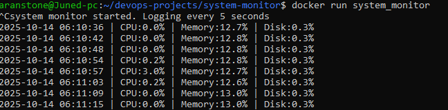

# System Monitor

Description:
This project monitors CPU, Memory, and Disk usage on a Linux system in real time.
It logs the output with date and timestamp every 5 seconds and is containerized with Docker.

Tools:
- Python
- Docker
- Linux

How to run:
```bash
docker build -t system_monitor .
docker run system_monitor
```
output:
- This will log the respective values in log file with date and time stamp while 
simultaneously printing it on the screen in realtime.
- bellow is the screen shot for the output:



