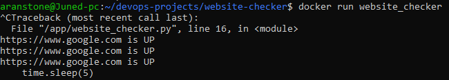

# Website Checker

Description:
This project checks if a website is online and prints the HTTP response code using Python.
It is containerized with Docker.

Tools:
- Python
- Docker
- Linux

How to run:
```bash
docker build -t website_checker .
docker run website_checker
```

Output:
Prints the website status (HTTP code) in real time.

Screenshot:



